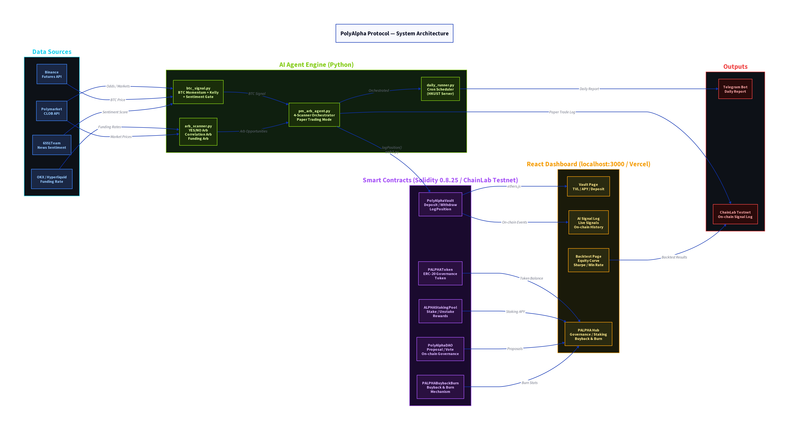

<div align="center">
  
  <br />
  <h1>PolyAlpha Protocol</h1>
  <p><strong>A DAO-Governed, AI-Driven Market-Making Vault for Decentralized Prediction Markets</strong></p>

  <p>
    <a href="https://polyalpha-dashboard.vercel.app"></a>
    <a href="https://testnet.chainlab.fun"></a>
    <a href="https://github.com/YongWilliam-ai/polyalpha-protocol/blob/main/LICENSE"></a>
    
    
  </p>
</div>

---

## 📖 Overview

**PolyAlpha Protocol** democratizes institutional-grade quantitative arbitrage by allowing anyone to deposit USDC into an on-chain vault. An off-chain AI agent, integrated with proven open-source technologies, executes automated market-making strategies on Polymarket, generating yield for depositors.

This project was developed as the final project for **ISOM3270 (Blockchain Programming in Business Applications)** at HKUST.

### 🌟 Key Features

- **ERC-4626 Tokenized Vault**: Non-custodial, transparent yield generation.
- **AI Swarm Consensus**: Multi-agent architecture (MiroFish) for robust signal validation.
- **BitPilot Safety Chain**: Hardcoded 6-layer risk management (max drawdown, position limits).
- **DAO Governance**: $PALPHA token holders control protocol parameters via a 48-hour timelock.
- **Deflationary Tokenomics**: 20% of performance fees are used to buy back and burn $PALPHA.

---

## 🏗️ System Architecture

The protocol is divided into three modular, interoperable layers:

1. **Data Sources**: Real-time CLOB data from Polymarket, sentiment scores from 6551Team News API, and Binance price feeds.
2. **AI Agent Engine (Python)**: A 4-layer signal stack that ingests data, generates momentum signals, validates via Swarm AI, and executes trades with Quarter-Kelly sizing.
3. **Smart Contracts (Solidity)**: Deployed on the ChainLab Testnet, handling deposits, withdrawals, staking, and governance.

---

## 📜 Smart Contracts

All contracts are compiled with **Solidity 0.8.25** and deployed on the **ChainLab Testnet (chainId: 31337)**.

| Contract | Description | Address |
|----------|-------------|---------|
| `PolyAlphaVault.sol` | Core ERC-4626 vault managing USDC deposits and AI trade logging. | `0x1c275054C7159aBBF446E652A744EFB8cbf6efd0` |
| `PALPHAToken.sol` | ERC-20 governance token (100M Max Supply). | `0x36381Cd13C9030Eb7dfa7C274837115370FEcdbF` |
| `PolyAlphaDAO.sol` | On-chain governance with 48h timelock. | `0x03C56c5bFc857694ECfdfCCa49456d67340E2BF0` |
| `ALPHAStakingPool.sol` | Staking contract yielding 10% APY + protocol revenue share. | `0xF8E9E3af72E1F673B21eCB4d96C99BF9c1D47832` |
| `PALPHABuybackBurn.sol` | Mechanism to buy back and burn PALPHA using performance fees. | `0xEc33dBc9dFAa1c380863547C5bCB7597eD611Ea4` |
| `MockUSDC.sol` | Testnet USDC for development and testing. | `0x77D7D52eE789B7C6bcD94eb87e2391BBb94A8D0a` |

---

## 🚀 Getting Started

### Prerequisites
- Node.js (v18+)
- Python (3.11+)
- Hardhat

### 1. Clone & Install
```bash
git clone https://github.com/YongWilliam-ai/polyalpha-protocol.git
cd polyalpha-protocol

# Install Smart Contract & Frontend dependencies
npm install
cd frontend && npm install && cd ..

# Install Python Agent dependencies
cd agent
python -m venv venv
source venv/bin/activate
pip install -r requirements.txt
```

### 2. Environment Setup
Create a `.env` file in the root directory:
```env
PRIVATE_KEY=your_wallet_private_key
CHAINLAB_RPC_URL=https://testnet.chainlab.fun
```

### 3. Run the Frontend Dashboard
```bash
cd frontend
npm start
```
The dashboard will be available at `http://localhost:3000`.

### 4. Run the AI Agent (Paper Trading Mode)
```bash
cd agent
python agent.py
```

---

## 📊 Tokenomics ($PALPHA)

- **Total Supply**: 100,000,000 PALPHA
- **Distribution**:
  - 40% Community & Early Depositors
  - 20% Team & Founders (Vested)
  - 20% DAO Treasury
  - 20% Liquidity & Ecosystem

---

## ⚠️ Disclaimer

This project is developed for academic purposes (ISOM3270 at HKUST). The smart contracts have not been professionally audited. The AI trading strategies are experimental and currently run in paper-trading mode. **Do not use real funds.**

---
*Built by William Yong (HKUST RMBI)*
